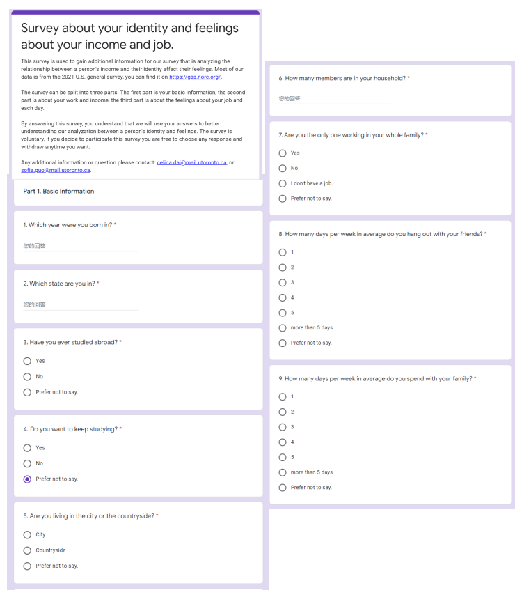
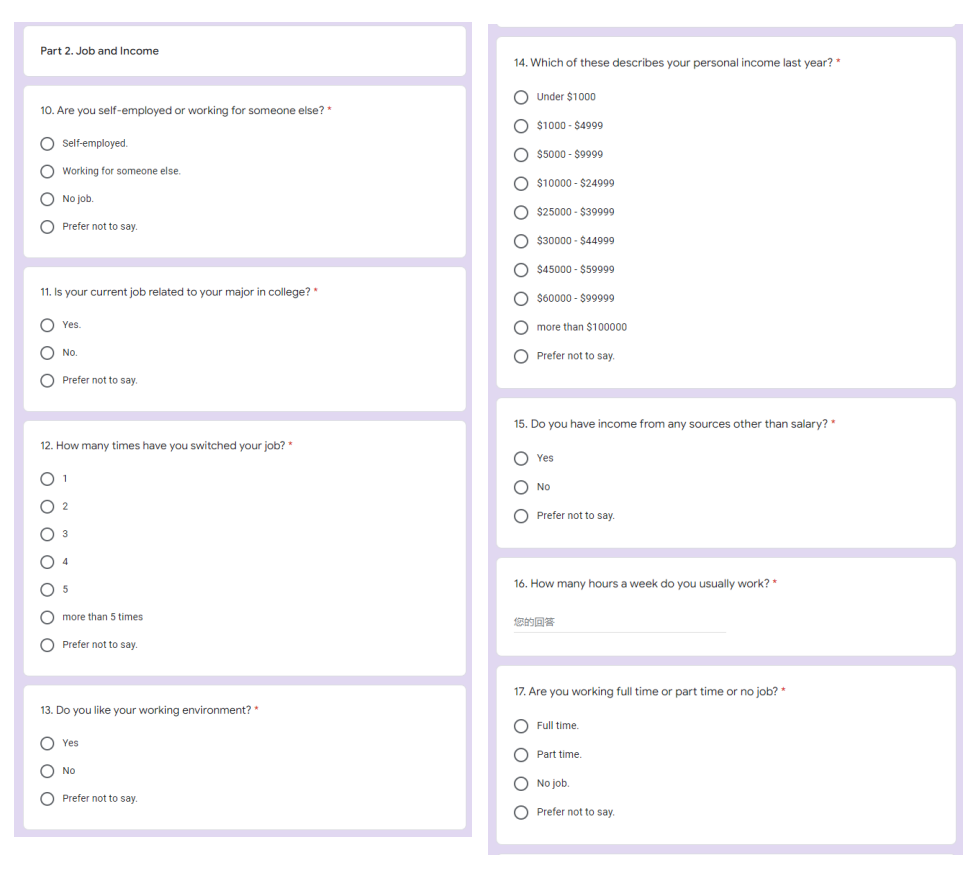
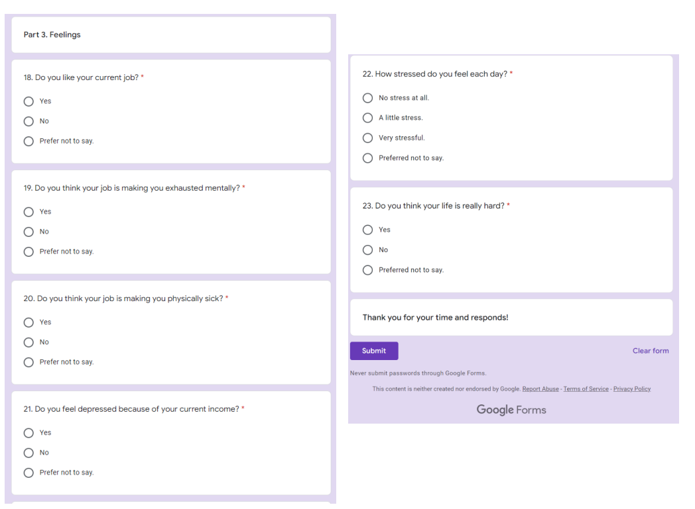

```{r setup, include=FALSE}

library(tidyverse)
library(dplyr)
library(caret)
library(ggplot2)
gss <- read.csv("/home/jovyan/1STA304/paper3/STA304-Paper3/outputs/data/cleaned_gss.csv", stringsAsFactors = FALSE)
```

# Introduction

The world is getting better, so is people's live condition. People are studying deeper, getting higher degrees, and making more money. At the same time, people's emotions become a huge problem. People are easier to get emotional, the life becomes more stressful for everyone. Hence, better live condition does not seem to change people's lives in a good way. Also, there is scientific evidence showing that people's health and happiness are closely related in today's society. However, as people's living conditions improve, it seems that more and more people are unhappy. Hence, it is interesting and important to find out the reason why. 

This paper had analyzed the relationship between a person's identity and their feelings. The meaning of identity here includes a person's income, degree, and so on. The thing we are mainly focusing on is the person's income and feelings. The whole analysis had been done using R studio [@citeR], which is a really great tool for analyzing and predicting data.  It is important to analyze this since money and happiness are both important to people, hence we want to know if people can get happier if they have more money.  The data was using the United States general social survey,  in order to find the data, please read the "README" document for the direction of where to find the U.S. general social survey data. Since it is the United States general social survey, the group of people we are focusing on in this paper is American. We believe it will be similar to other countries' people since we are all humans. In order to analyze this, the logistic regression model had been used. It is interesting that we found people that who earn more income seem to feel worse. There may be a lot of reasons that cause this to happen, but the lack of information caused us cannot analyze deeper. 


This paper had split into five parts. The first section is the introduction which is here \@ref(introduction).The section \@ref(data) talks about the collection process. Also, the data characteristics and the relationship between the data we had chosen were explained in this section too. How the survey works and the weakness of the survey also had been explained in this section. The next section is \@ref(method). In this section, the method we used to analyze the data set had been explained. Then, it is the \@ref(results) section. Here the result we got using the method had been shown and explained. Next is the \@ref(discussion). Here we talked about the connection between the world and the results we got. Also, some suggestions had been made to people. Also, the weakness of this paper and what we should do to improve it next time is also in this section.

# Data

## Data Collection 

In our modern society, an income of a person depends on many factors, such as their educational degree, the city where they live, and so on. There is a General Social Survey (GSS) survey result we are going to use to analyze the relationship between income and other things. And what we study in this assignment is how a person's income affects their feelings and the connection to many other factors. This dataset is unique, there is not really a similar dataset like this except the social general survey for other countries or other years. We choose the general social survey for the United States since this country is near where we are and the U.S. is a big developed country. Also, select 2021 as the year to analyze is because it is the most recent year.

There are 4032 observations and 565 variables in the original dataset. However, the areas involved in these factors are very broad, and there are all kinds of content. Many of them have no connection on the subject of our study, or some of them even does not have an answer.  So we selected eight of the most important factors for our study. Due to many people did not answer some of the questions, we were left with 2949 observations and 7 variables after screening for these factors. 


## Data Characteristics
 
In order to study the data, cleaning is a really important thing to do, the package tidyverse [@aaa], dplyr [@dplyr]. In the data cleaning part, we choose sex which is a categorical variable as basic information. We renamed "1" as males and "2" as females. Then, we selected the variable called age which is a numerical variable also as basic information. Also, the people that is 18 or older are the ones being selected since most of people that have work is older than 18. 

The main variable in this paper is called income which is a numerical variable, it defines a family's income. We use "1" indicates under $1000, "2" represents $1000-$2999, "3" means $3000-$3999, "4" is $4000-$4999, "5" as $5000-$5999,  "6" indicates $6000-$6999, "7" as $7000-$7999, "8" means $8000-$9999, "9" is $10000-$14999,  "10" is from $15000 to $19999,  then "11" is $20000-$24999,  finally more than $25000 as “12”. The number "13" means refused to answer, so we also filtered out this variable since it will not help our studies at all. Then, we also choose the degree as a categorical variable, and less than high school indicates “0”, high school means “1”, associate/junior school is  “2”, bachelors as “3”, and graduate indicates “4”. Furthermore, there are two variables about feeling we kept which called happy and "satfin" in order to find out what kind of linear relationship they have with income. For happy, we use "very happy" which indicates “1”,  "pretty happy" as “2”, “3” renamed as "not too happy". The is a variable called “satfin” got renamed as satisfaction which represents the family income compared with American families in genera. In this variable, we use pretty well satisfied indicates “1”, more or less satisfied indicates “2”, not satisfied as “3”. Lastly, there is another variable called “finrela” we choose, which compare the family income with American families. We renamed it as “income_vs_average”. In this case, far below average is “1”, below-average means “2”, average indicates “3”, above-average is “4”, finally, far above average indicates “5”. After the long process of renaming and selecting the variables, we filtered out the answers that is not available, which means we are only going to focus on the people that answered all of the questions about the selected variables.
 
There, the fllowing table [\@ref(tab:var)] shows the meaning of each variable.

```{r var, echo=FALSE}
knitr::kable(
  data.frame(variable = c("age", "sex", "degree", "income", "happy", "satisfication", "income_vs_average"),
             Meaning = c("date of birth has been recorded into actual age", "gender of the person", "highest education degree", "in which group does the person total family income", "how people say about the feeling for these days", "how people are getting along financially these days", "the family income compared with American families in general")),
  caption = 'Variable Meaning')
```


## Data Relationships

In order to find out the relationships between variables, graphics had been drawn to help us visualize. To draw graphs, the package ggplot2 [@ggplot2] From the histogram about income [\@ref(fig:his)], we can see that the income level 11, which means the salary between $20000 and $24999, takes the highest proportion among all observations and almost reach 2200 individuals out of 3307 samples. Level 4 and level 6 in the graph represent the salary between $4000 and $4999, and the salary between $6000 and $6999 is the lowest. The median is around 12 and mean is around 11. Also, the graph is unimodal left-skewed. Then the bar plot [\@ref(fig:deg)] shows the distribution about degree. The “high school” level takes the largest proportion among them all, which means most people have no higher degree than high school. Meanwhile, the proportion of people does not finish high school is the lowest.

The bar plot [\@ref(fig:avg)] show the relationship between degree and family income compared with American families in general. Most of those with family incomes lower than those in the American families did not complete high school or only completed high school. There is also some family with below-average economic conditions in other categories, but only a very small percentage. On the contrary, most of the families whose income is higher than that of American families are undergraduates or graduate students and Ph.D. Therefore, education degrees and family incomes compared with American families are proportional. The family income of people with higher education is more ideal, and the income of people with lower education is more general. The next bar plot [\@ref(fig:inc)] shows the relationship between how people are getting along financially these days and the family income compared with American families in general. The graph shows that there are few people far above average or far below average. Most of the people below average feel like they are not satisfied with the current situation. However, most people above average feel like they are OK with the current situation.

## Survey Methadology 

This collection surveyed a lot of people, so we got a large number of data from this survey. However, not all of the questions was answered, so after the data cleaning process, there were only about 3,000 people who answered all of the questions. This is the weakness of this set of data. At the same time, the population we are looking at should be all people that are in America, but throughout this survey, the sample is the people who take the survey which is randomly chosen. Also, there are some methodological changes in the 2021 GSS Cross-section. For example, the 2021 GSS changed the way to contact people, they used a mail to push-to web instead of visit each person to do data collection, hence there may be some answers wrong if the person answered the survey was not focused. Also, 2021 GSS uses the last birthday method instead rostering the household and respondent selection via a Kish grid.. 

As mentioned before, the survey is spreading online this year. The good thing about online surveys is that people are not too shy or too embarrassed to answer some questions, after all, online can be anonymous, and no one will know exactly what you have answered. At the same time, it also has certain limitations. For example, some people choose not to answer some questions, or they just randomly select some answers without thinking about the question which also causes some information deviations, and when people have questions about this survey, they cannot get answers in time.

For those who did not answer some of the questions, we chose to delete them in the data clean step. This means, each of the 3308 people in our cleaned data now answers questions about our eight variables. More than a thousand other people who were screened out, at least one question was left unanswered. Therefore, we have kept all the answers in this way to ensure the clarity and accuracy of the data. The advantage of this questionnaire is that it is very detailed about each question and contains most of the key points, but its disadvantage is that too many people do not answer all the questions, resulting in a lack of information and increased cleaning data steps.


# Method 

The method being used here is the logistic regression model. The model is $log(\frac{p}{1-p})=\beta_{0}+\beta_{1}x$. The "p" represents the probability of the thing occurring, and "$\beta_{0}$ and $\beta_{1}$" represents the regression coefficients. A positive $\beta_{1}$ means that increasing x will be interrelated with increasing p. A negative $\beta_{1}$ means that decreasing x will be interrelated with decreasing p. The logistic regression model is commonly used for predictive analytics and modeling. The reason to choose this method is it can help to understand the relationship between a dependent variable and independent variables and predict the likelihood of something happening or how likely a choice will be made. There can be more than one independent variables which means there can be $\beta_{1}, \beta_{2}, ...., \beta_{n}$. This method will estimate probabilities with the equation for logistic regression. [@Logistic]The R function glm() is been used here for generalized linear model which is used to compute the logistic regression[@caret]. 

In this case, the dependent variable is happy, and the independent variable is income. Happy represents the feeling of a person is everyday, and income represents how much a family made every year. Happy is a categorical variable, and income is a numerical variable. Using this method, the likelihood of how likely a person's feeling can be changed if their family income goes up. The data had been randomly split into two parts, test data and train data. The test data contains 20% of the data for evaluating the model, and the train data contains 80% of the data for building a predictive model.


```{r, include=FALSE}
gss_new <- gss%>%
  mutate(happy = case_when(
    happy == "Not too happy" ~ "Not too happy",
    happy == "Pretty happy" ~ "Happy",
    happy == "Very happy" ~ "Happy"
  ))
set.seed(1000)
training.samples <- gss_new$happy %>%
  createDataPartition(p=0.8, list=FALSE)
train.data <- gss_new[training.samples,]
test.data <- gss_new[-training.samples,]
model <- glm(as.factor(happy) ~ income, data = train.data, family = binomial)
summary(model)
prob <- model%>%
  predict(test.data, type="response")
predict.classes <- ifelse(prob > 0.5, "Happy", "Not too happy")
mean(predict.classes == test.data$happy)
train.data %>%
  mutate(prob = ifelse(happy == "Happy", 1, 0))%>%
  ggplot(aes(income, prob))+
  geom_point(alpha=0.2)+
  geom_smooth(method = "glm", method.args = list(family = "binomial"))
```


# Results

By calculation, the model is $log(\frac{p}{1-p})=-0.43-0.067x_{income}$. The coefficient estimate of income is -0.067, it is negative, which means that an increase in income will be associated with a decrease probability of being happy. Hence, from the model we know, for every addition unit increase in income, we expect the odds of being happy change by exp(-0.067)=0.94 times. This is really interesting, it shows a negative relationship between people feels happy and their income. The more money a family made, they got a higher chance to be unhappier. The classification prediction accuracy is only 0.24 which is not so good, the misclassification error is 0.76.

As the table[\@ref(tab:estimate)] shows, the estimate is $\beta_{0}$ and the estimated $\beta$ coefficients are associated with each predictor variables. The std. error represents the standard error of the coefficient estimates, which is the accuracy of the coefficient. Since the standard error is small, then we are really confident about the estimate. The z value is the z-statistic, it is just the coefficient estimate divided by the standard error. The Pr$(>|z|)$ is the p-value since it is really small, so the estimate is significant.

The graph in [\@ref(fig:mod)] shows the probability of people feels happier versus income. The 0 on the y axis means not too happy, and 1 is happy. The logistic curve is a straight line here. The points on the graph shows the relationship between the income and happy, it seems to be split randomly in both happy and not too happy.

```{r mod, fig.cap="Logistic Regression Model for happy vs. income", message=FALSE, echo=FALSE}
train.data %>%
  mutate(prob = ifelse(happy == "Happy", 1, 0))%>%
  ggplot(aes(income, prob))+
  geom_point(alpha=0.2)+
  geom_smooth(method = "glm", method.args = list(family = "binomial"))+
  labs(
    title = "Logistic Regression Model", 
    x = "income",
    y = "Probability of being happy"
    )
```


```{r estimate, echo=FALSE}
knitr::kable(
  summary(model)$coef,
  caption = 'Estimate Table')
```

# Discussion

## Relationship between feelings and income

In this paper, the relationship between people's feeling and their income had been analyzed. According to the analysis and the graphs, it is obvious that there is a relationship between a person's identity and how they feel. But, the result is really interesting since people with higher income seem to have more annoyance. Also, we find out that there is a relationship between the education degree and family income. This shows that people with higher degrees are always related to high-income families. On the contrary, people with lower family incomes always have not finished higher degrees such as university or graduate.

At the same time, we also find the relationship between how people are getting along financially these days and the family income compared with American families in general. Most people below average feel like they are not satisfied with the current situation. However, most of the people above average feel like they are OK with the current situation.


## Connection to the world

We find the most important thing is that the people with more income seem not happy as we thought. From WHO (World Health Origination) we can see that the data shows that from last 10-15 years, depression has increased by nearly a fifth, and in 1945 we had 10 times as many people with depression[@happy], and over 350 million people worldwide suffered from depression in 2019, an increase of approximately 18% over the past decade [@ra]. This reflects the increasing number of people suffering from depression in recent years. At the same time, people's living conditions and incomes have definitely gotten better and better over the past decade. Throughout this comparison, we can see that the relationship between income and happiness is inversely proportional.

The first reason is that when money solves the basics of life, the feeling of happiness diminishes. We saw a graph online that was very similar to what we saw in the method [@ha], and they also showed the relationship between happiness and income. We can see that in about the first quarter of the curve, the uptrend is more obvious, and gradually, the uptrend gets smaller and smaller, and finally approaches a straight line. This shows that from the beginning, the improvement of wealth can indeed greatly improve people's happiness index because, at this stage, many of our basic needs need to be met and supported by money. As wealth continues to increase while making money, you will feel less and less happy, and even your happiness will continue to decline.

The second reason is that most people with high incomes are very busy, which makes them feel less happy. Many high-income people need to spend a lot of time and energy on their work, and this business will give them mental stress, and they will feel less relaxed and happy. Also, because life is too busy, many people will not have time to take care of their family and children, which will cause some family conflicts and negative emotions for them. In the end, although these high-income people are not short of money, it may be because they are busy that they have no time to enjoy life. They only see the hard work of making money and do not feel the joy of spending money, so they become less happy.


## Weaknesses and next steps

There are some weaknesses we cannot avoid in this report, and there are also some improvements we can go further on both the data collection part and the data analysis part. First of all, this questionnaire covers a variety of questions, about people's daily life, mental situations, emotional states, some questions about society, and so on. Which includes 4032 observations and 565 variables in the original dataset. We are looking for the impact of income on people in this report and we chose seven variables related to income to do this research. Compared to more than 500 variables, we only conclude seven variables, which is not comprehensive for this survey. In future research, the main point we can improve is to cover different fields, such as psychology, environment, and emotional states. By doing so, we can see more social situations throughout this survey in the future. There is also an additional information survey we made in the Appendix that this information can help us to see more relationships between income and other things to a person.

Secondly, most of the seven variables we selected are categorical variables. It is understandable that the form is multiple-choice questions which are more convenient for people to answer as a survey. Although categorical variables can do many graphs, we cannot make line graphs nor show the relationships between each categorical variable. In method, we can't do it with linear regression either. Compared with numerical variables, categorical variables uses different types to compare with each instead of using some specific data to support. In future research, It is better to use more numerical variables, with more numerical assumptions to support our final results.

Next, as we know, the model accuracy is about the proportion of observations that are correctly satisfied or not. In our method classification prediction accuracy is only 0.24, this is not good and will affect our method to an inaccurate result. The classification error is 0.76 which means our estimated model is not so accurate and our method may not be so accurate. We can change the method for selecting data to improve this problem.

The last weakness of this report is the original data set. The GSS survey in 2021 was changed to an online survey instead of a face-to-face interview. As a result, there may be three problems that may occur. First, the surveyed population may be more skewed towards young people than older people who do not use the Internet. Secondly, there are many questions that have not been answered. We received maybe because of online reasons, people's survey results are not complete, and many questions have not been answered. Finally, if people have any questions, they can't get timely answers. In future surveys, if we collect the survey through a combination of the online and in-person methods together, there should be more comprehensive information provided to us.

## Suggestion based on the result
Based on the previous analysis, here are a few suggestions to make everyone happy. First of all, don't be too anxious, whether it's high-income or low-income, there are many people satisfied with their current life with low-income, on the contrary, not all rich people feel happy all the time. Secondly, let happiness be based on the enjoyment of life, not money. The important thing is to enjoy life and family, and spend more time on family and friends to make yourself happy. Finally, if you find that you are unhappy for a long period of time, you can try to see a psychiatrist and do some self-regulation to avoid depression and anxiety. Health and happiness are the foundation of everything.

\pagebreak

```{r his, fig.cap="Graph of income", echo=FALSE}
ggplot(gss, aes(x=income))+
  geom_histogram(bins=12, color="black", fill="pink")+
  labs(x="Income")
```

```{r deg, fig.cap="Graph of degree.", echo=FALSE}

gss%>%
  ggplot(aes(x=degree))+
    geom_bar(color="black", fill="purple")+
    labs(x="degree")
```


```{r avg, fig.cap="Graph of degree with Income vs. Average graph filled in.", warning=FALSE, echo=FALSE}

gss%>%
  ggplot(aes(x=degree,fill=as.factor(income_vs_average)))+
  geom_bar(binwidth = 0.15)+
             theme(axis.text.x = element_text(color = "grey20", size= 6))
```


```{r inc, fig.cap="Income vs. Average graph with satisfaction filled in.", echo=FALSE}

  gss%>%
    ggplot(aes(fill=satisfaction, x=income_vs_average)) + 
      geom_bar(position = "dodge")+theme_classic()+
               theme(axis.text.x = element_text(color = "grey20", size= 6))
```


\newpage

\appendix

# Appendix {-}

## Supplementary Survey

The survey is to help us gain additional information can been found in the link: https://docs.google.com/forms/d/e/1FAIpQLSezLXAD8lxUxCVQh7_Il09KAUsmLFbG5xSJVl5AkRR77-186A/viewform?usp=sf_link. 

The [\@ref(fig:sur1)] includes the introduction and the part for person's basic information question. The next picture [\@ref(fig:sur2)] includes the questions about a person's income and work. The last picture [\@ref(fig:sur3)] is the part of survey about a person's feelings.


```{r sur1, fig.cap="Part 1 and the introduction of the survey", echo=FALSE}

```


```{r sur2, fig.cap="Part 2 of the survey", echo=FALSE}


```


```{r sur3, fig.cap="Part 3 of the survey", echo=FALSE}



```


\newpage


# References {-}


